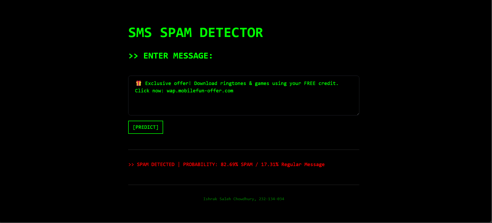
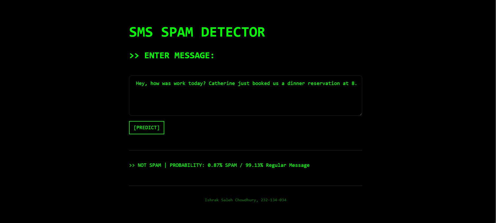
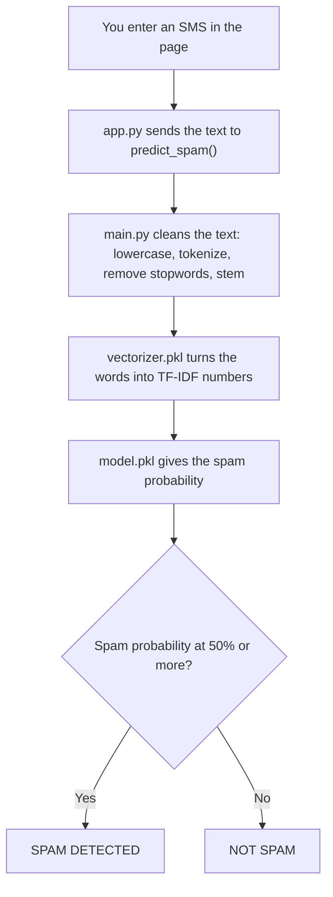

<h1 align="center">SMS Spam Detector</h1>

<p align="center">
  A small web app that reads an SMS and tells you if it is spam, with a probability score.
</p>

<p align="center">
  
  
  
  
</p>

<p align="center">
  
</p>

<p align="center">
  
</p>

## Contents

- [Overview](#overview)
- [How it works](#how-it-works)
- [Dataset](#dataset)
- [Project structure](#project-structure)
- [Install](#install)
- [Model results](#model-results)
- [Design decisions](#design-decisions)
- [Missed spam and false alarms](#missed-spam-and-false-alarms)
- [Testing](#testing-by-breaking-it)
- [Known limits](#known-limits)
- [Future work](#future-work)

## Overview

You type or paste an SMS into the page and press **[PREDICT]**. The app cleans the text, turns it into numbers, and a trained model decides if it is spam. The result shows the label and both probabilities.

- Labels a message as **SPAM** or **NOT SPAM**.
- Shows the spam probability and the regular message probability.
- Trained on 5,169 messages. I compared 6 models and kept the one with no false alarms on the test set.
- Plain Python with NLTK, scikit-learn, and Streamlit. The model runs on your own computer, with no API and no internet needed after setup.

## How it works

The work is split into three parts. The notebook trains the model once. After that, the backend and the frontend only load the saved files.

| Part | File | What it does |
| --- | --- | --- |
| Training | `notebook/spam_detection.ipynb` | Cleans the data, compares 6 models, and saves the vectorizer and the model |
| Backend | `backend/main.py` | Cleans a message and returns the label and the spam probability |
| Frontend | `frontend/app.py` | The Streamlit page with one text box and one button |



**Step 1: clean the text.** Raw SMS text has capital letters, punctuation, and words like "to" and "now" that say nothing about spam. `transform_text()` in `main.py` removes them. This is what happens to one message:

| Step | Result |
| --- | --- |
| Original | `Free entry! Txt WIN to 80086 now` |
| Lowercase | `free entry! txt win to 80086 now` |
| Split into words | `free` `entry` `!` `txt` `win` `to` `80086` `now` |
| Keep letters and numbers only, remove stopwords | `free` `entry` `txt` `win` `80086` |
| Stem with the Porter Stemmer | `free entri txt win 80086` |

The model scores this cleaned message at 89.77% spam.

**Step 2: turn words into numbers.** A model cannot read words, so `TfidfVectorizer` gives each word a weight. A word that shows up often in one message but rarely across all messages gets a high weight. The vectorizer keeps the 3,000 most common words and looks at single words only.

**Step 3: predict.** A Multinomial Naive Bayes model takes those numbers and gives the chance that the message is spam (`predict_proba`). The app calls the message spam when that chance is 50% or more.

## Dataset

The data is in `data/spam.csv`. Each row is one SMS with a label of `ham` (a regular message) or `spam`. I read it with `latin-1` encoding. I dropped the three empty extra columns and turned the labels into `0` (ham) and `1` (spam).

| Item | Value |
| --- | --- |
| Rows in the file | 5,572 |
| Duplicates removed | 403 |
| Messages used | 5,169 |
| Ham | 4,516 (87.37%) |
| Spam | 653 (12.63%) |
| Train / test split | 80 / 20, `random_state=2` |
| Test messages | 1,034 (896 ham, 138 spam) |

Two things I noticed while exploring the data:

- Spam messages are longer. The middle spam message is 149 characters. The middle ham message is 52.
- The most common words in spam, after cleaning, are `call`, `free`, `txt`, `text`, `mobil`, `stop`, and `repli`.

## Project structure

```
SMSSpamDetector/
├── frontend/
│   └── app.py                # Streamlit page
├── backend/
│   ├── main.py               # transform_text() and predict_spam()
│   └── model/
│       ├── vectorizer.pkl    # Saved TF-IDF vectorizer
│       └── model.pkl         # Saved Multinomial Naive Bayes model
├── notebook/
│   └── spam_detection.ipynb  # Cleaning, exploring, comparing models, saving files
├── data/
│   └── spam.csv              # The dataset
└── images/                   # Screenshots for this ReadMe
```

## Install

Python 3.9 or higher is needed.

1. Clone this repository.
2. Install the packages:

   ```bash
   pip install streamlit nltk scikit-learn
   ```

3. From the project root folder, run:

   ```bash
   streamlit run frontend/app.py
   ```

The first run downloads three NLTK resources on its own: `punkt`, `punkt_tab`, and `stopwords`. Your browser opens the page.

## Model results

I trained 6 models on the same split and the same 3,000 features. The scores below are on the 1,034 test messages.

| Model | Accuracy | Precision | Spam recall | False alarms | Missed spam |
| --- | --- | --- | --- | --- | --- |
| Bernoulli Naive Bayes | 98.36% | 99.19% | 88% | 1 | 16 |
| Extra Trees | 97.87% | 97.54% | 86% | 3 | 19 |
| **Multinomial Naive Bayes (used)** | 97.10% | 100% | 78% | 0 | 30 |
| Logistic Regression | 95.26% | 97.85% | 66% | 2 | 47 |
| K-Nearest Neighbors | 90.52% | 100% | 29% | 0 | 98 |
| Gaussian Naive Bayes | 87.33% | 51.60% | 82% | 106 | 25 |

- **False alarm:** a regular message called spam.
- **Missed spam:** a spam message called regular.
- **Precision:** of the messages called spam, how many really were spam.
- **Spam recall:** of all the spam messages, how many the model caught.

## Design decisions

| Decision | Why | Cost |
| --- | --- | --- |
| Multinomial Naive Bayes as the final model | It made 0 false alarms on the test set, so a regular message was never called spam. It is also fast and gives probabilities. | It missed 30 of 138 spam messages (78% recall). Bernoulli Naive Bayes missed only 16. |
| Not Logistic Regression | I tried it. It had 2 false alarms and only 66% spam recall, so it was worse than Multinomial Naive Bayes on both counts. | None. It is only kept in the notebook comparison. |
| Compare 6 models, not just one | The best model on accuracy was not the best on false alarms. Comparing showed me the trade-off. | A longer notebook. |
| Remove duplicate messages before the split | The same message cannot be in both the training and the test set, which would make the scores look better than they are. | 403 fewer rows. |
| TF-IDF with `max_features=3000` | Keeps the number of words small, so the model stays small and fast. | Rare words are dropped. |
| Keep only letters and numbers (`isalnum()`) | Removes punctuation and symbols in one check. | It also removes emojis and many non-English words (see the tests below). |
| Stopword removal and Porter stemming | Fewer word forms means the model sees "winning" and "win" as the same word. | Some meaning is lost, and `u` and `ur` stay because NLTK does not list them as stopwords. |
| Fixed 50% line for the label | It is the default and easy to explain. | See the next section. |
| Streamlit for the page | The whole project stays in Python. | Less control over the layout than a real web framework. |

## Missed spam and false alarms

There are two ways to be wrong, and they do not hurt the same way.

| Error | What happened | Who it hurts |
| --- | --- | --- |
| False alarm | A regular message is called spam | The person may miss a message they wanted |
| Missed spam | A spam message is called regular | The person may click a link or call a number |

I picked Multinomial Naive Bayes to keep false alarms at zero. After testing it, I think a missed spam can do more harm than a false alarm, because the person may act on it. The 50% line is the reason for the missed spam, so I rebuilt the same split and moved the line to see what changes:

| Spam line | False alarms | Missed spam | Spam recall |
| --- | --- | --- | --- |
| 50% (used now) | 0 | 29 | 79.0% |
| 40% | 2 | 21 | 84.8% |
| 30% | 6 | 17 | 87.7% |
| 20% | 34 | 14 | 89.9% |

Going from 50% to 40% catches 8 more spam messages for the price of 2 false alarms. After 30%, false alarms grow fast and the gain gets small. The app still uses 50%. This table is from a rebuild of the notebook steps, and it is 1 message different from the notebook at the 50% line (29 missed here, 30 in the notebook).

The spam that gets missed at 50% often has no strong spam words. For example, a quiz-style message with a balance and a question, and a "missed call alert" that only lists a phone number.

## Testing

I sent odd messages straight into `predict_spam()` to see where the model fails.

| What I tried | Spam score | What I learned |
| --- | --- | --- |
| A prize message in ALL CAPS | 95.69%, same as the normal version | `lower()` makes capital letters not matter. |
| Two words: `WIN FREE` | 59.43% | Very short spam sits close to the 50% line. |
| Spaced letters: `F R E E prize! C a l l now` | 85.93% | Still caught, but only because of `prize` and `now`. The spaced letters become useless single-letter words. |
| A delivery scam with a link | 35.95%, missed | Modern scams with links are not in the training data. |
| A bank phishing message | 41.51%, missed | The words in it are rare in the old spam the model learned from. |
| A delivery scam with no link | 13.63%, missed | Nothing in it looks like the old spam. |
| A regular message with `call`, `text`, and `free` | 14.38% | Spam words alone are not enough to trigger spam. |
| `Good luck in the match today, hope you win!` | 12.93% | `win` alone does not trigger spam. |
| A regular message with numbers (`bus 42`, `at 5`) | 1.12% | Numbers alone do not trigger spam. |
| A very long regular message | 1.32% | Length is not a problem. |
| Bangla words in English letters | 22.94% | Words the model has never seen are ignored, so this is a guess. |
| A spam message in Bangla script | 12.45%, missed | `isalnum()` removes most Bengali words because of their vowel marks. Only 2 words were left. |
| Only emojis, or only `!!!???` | 12.45% | No words are left, so the score falls back to the share of spam in the training data. It is not a real judgement. |

I tested `predict_spam()` directly, not the Streamlit page. The page already blocks an empty box, but a box with only symbols still gets a score.

## Known limits

- It only knows the old style of spam in the dataset, like prize draws and premium numbers. Modern delivery and bank scams are often missed.
- At the 50% line it missed 30 of 138 spam messages on the test set.
- English only. Bengali script is mostly dropped, so a Bangla spam message will nearly always pass.
- A message with no usable words gets about 12.45% spam, which is only the spam share of the training data.
- The test set has only 138 spam messages and I used one split, so the scores can move a little on a different split.
- The saved `.pkl` files depend on the scikit-learn version used to train them. A very different version can fail to load them.

## Future work

- Move the spam line to around 40% or switch to Bernoulli Naive Bayes, so fewer spam messages are missed.
- Use cross-validation instead of one split, to get scores I can trust more.
- Add newer spam examples, especially delivery and bank scams.
- Handle Bengali text, and show a warning when a message has no usable words.
- Load the stopword list once in `main.py` instead of on every word, to speed it up.
